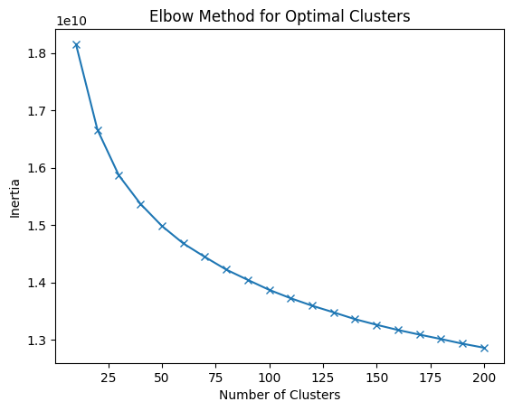

# Assignment Report: VR Assignment 2 - Part B

**Authors:**
- Subhajeet Lahiri - IMT2021022
- Sai Madhavan  G - IMT2021101
- Aditya Garg - IMT2021545

## Introduction

This report presents the implementation and results of a category recognition task as a part of VR Assignment 2 - Part B. The objective of this task is to classify images between bikes and horses using a visual bag of words approach. The approach involves extracting interest points and their descriptors, clustering these features to obtain visual words, and finally, characterizing images based on histograms of these visual words. Various classifiers are trained on these histograms to perform the classification task.

## Dataset Description

The dataset provided for this task consists of 99 images of horses and 80 images of bikes. The images exhibit diversity in terms of intra-class variants such as postures, lightings, occlusions, and image quality.

## Implementation

### Feature Extraction and Clustering

For feature extraction and clustering, we implemented a `FeatureBag` class. This class iterates over all images in a given folder, extracts keypoints using the SIFT implementation of OpenCV, and clusters these features using KMeans from scikit-learn. We determined the optimal number of clusters to be 70 using the elbow method.

### Dataset Creation

A `Dataset` class is defined to handle the creation of the dataset. This class extracts image paths, generates histograms of features using the previously defined `FeatureBag`, and splits the dataset into training and testing sets.

### Training Models

We trained various classifiers on the dataset using scikit-learn and other libraries like XGBoost, LightGBM, and CatBoost. The classifiers include Support Vector Machine (SVM), Logistic Regression, K-Nearest Neighbors (KNN), Gaussian Naive Bayes, Random Forest, Gradient Boosting, XGBoost, LightGBM, CatBoost, and Multi-layer Perceptron (MLP) Classifier.

## Results and Discussion

| Model                | Precision (Bikes) | Recall (Bikes) | F1-score (Bikes) | Precision (Horses) | Recall (Horses) | F1-score (Horses) | Accuracy | 
|----------------------|----------------------|-------------------|---------------------|----------------------|-------------------|---------------------|----------| 
| SVM                  | 0.93                 | 0.88              | 0.90                | 0.90                 | **0.95**              | 0.93                | 0.92     | 
| Logistic Regression  | 0.93                 | 0.88              | 0.90                | 0.90                 | **0.95**              | 0.93                | 0.92     | 
| KNN                  | 0.88                 | 0.88              | 0.88                | 0.90                 | 0.90              | 0.90                | 0.89     | 
| Gaussian Naive Bayes | 0.57                 | **1.00**              | 0.73                | 1.00                 | 0.40              | 0.57                | 0.67     | 
| Random Forest        | 0.84                 | **1.00**              | 0.91                | **1.00**                 | 0.85              | 0.92                | 0.92     | 
| Gradient Boosting    | **0.94**                 | **1.00**              | **0.97**                | **1.00**                 | **0.95**              | **0.97**                | **0.97**     | 
| XGBoost              | **0.94**                 | 0.94              | 0.94                | 0.95                 | **0.95**              | 0.95                | 0.94     | 
| LightGBM             | **0.94**                 | **1.00**              | **0.97**                | **1.00**                 | **0.95**              | **0.97**                | **0.97**     | 
| Catboost             | 0.89                 | **1.00**              | 0.94                | **1.00**                 | 0.90              | 0.95                | 0.94     | 
| MLP                  | 0.93                 | 0.88              | 0.90                | 0.90                 | **0.95**              | 0.93                | 0.92     | 

We observed that Gradient Boosting and LightGBM classifiers provided the best performance with 97% accuracy and 97 F1 score. These classifiers outperformed other models on this specific task.

## Conclusion

In conclusion, the visual bag of words approach coupled with gradient boosting and LightGBM classifiers proved to be effective in classifying images of bikes and horses.